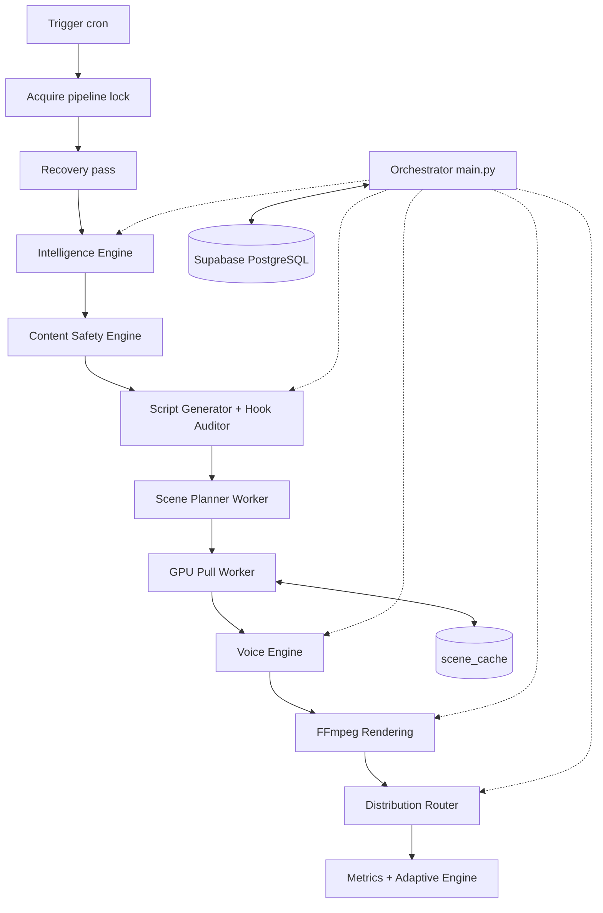

# MD-AME: Autonomous Media Engine

## Apa yang Dibangun

[MD-AME](https://github.com/okfriansyah-moh/md-ame) (Multi-Dimensional Autonomous Media
Engine) adalah pipeline produksi dan distribusi media yang sepenuhnya otonom. Sistem
mengonsumsi sinyal tren, menghasilkan skrip video terstruktur, merender aset sesuai
platform via FFmpeg, dan mempublikasikan ke platform sosial tanpa intervensi manusia
selama operasi normal. Setiap eksekusi pipeline adalah unit diskrit yang didukung
**Supabase PostgreSQL** sebagai satu-satunya sumber kebenaran.

## Masalah

Produksi konten otonom dalam skala membutuhkan operasi tanpa pengawasan selama berhari-hari
atau berminggu-minggu. Crash di tengah eksekusi tidak boleh merusak state, menduplikasi
video yang dipublikasikan, atau membiarkan pekerjaan terjebak permanen. State filesystem
lokal, pola read-modify-write sekuensial, dan worker non-idempoten semuanya merusak
pemulihan. Sistem harus mendukung banyak dimensi konten (niche) dari satu codebase
tanpa menduplikasi logika pipeline.

## Mengapa Masalah Ini Sulit

1. **Pipeline berjalan lama** — generasi skrip, sintesis suara, rendering GPU, dan upload
   bisa memakan banyak menit per video.
2. **Parameterisasi multi-dimensi** — setiap dimensi punya konfigurasi, profil keamanan,
   dan binding akun yang berbeda.
3. **Pekerjaan GPU terdistribusi** — generasi visual memakai model pull-worker terpisah
   dari cron orchestrator.
4. **Transisi state atomik** — update parsial pada baris job atau counter kuota menyebabkan
   race condition di bawah worker konkuren.
5. **Keamanan konten** — skrip dan topik hasil LLM harus lolos firewall dan gate
   classifier sebelum disimpan.

## Model Mental untuk Pemula

Bayangkan pabrik dengan satu mandor (orchestrator) dan buku besar pusat (PostgreSQL).
Setiap order kerja membawa **sidik jari** (`idempotency_key`). Mandor mengambil
**kunci global** sebelum mulai, memeriksa job yang macet dari shift sebelumnya, lalu
menjalani setiap dimensi melalui stasiun tetap: tren → skrip → suara → render → publish.
Jika listrik padam, shift cron berikutnya membaca buku besar dan melanjutkan tepat di
titik berhenti — tanpa output duplikat.

## Persyaratan dan Kendala

| Persyaratan | Implementasi |
|-------------|--------------|
| Pemulihan aman crash | Replay state machine via cron; recovery pass sebelum pekerjaan baru |
| Run idempoten | `idempotency_key` SHA-256 pada setiap baris work-unit |
| Transisi atomik | Fungsi RPC PostgreSQL — tanpa read-modify-write di aplikasi |
| Eksklusivitas global | RPC `acquire_pipeline_lock` / `release_pipeline_lock` |
| Isolasi lingkungan | `ENV=dev` atau `ENV=prod` ketat; proyek Supabase terpisah |
| Tanpa persistensi lokal | Semua state di PostgreSQL; tanpa SQLite atau file JSON antar run |
| Quality gate | Ambang hook audit, validasi safe-zone, HALT suara saat gagal |

## Ikhtisar Arsitektur



Orchestrator berjalan harian via cron GitHub Actions. Worker GPU mem-poll job
`visual_generation` secara independen memakai klaim `FOR UPDATE SKIP LOCKED`.

## Alur Eksekusi

1. **Entry pipeline** — generate `execution_id`, validasi `ENV`, acquire kunci global.
2. **Recovery pass** — identifikasi skrip macet (`voice_queued`, `render_queued`) dan
   resume atau fail sebelum generasi baru.
3. **Intelligence Engine** — ingest tren per dimensi aktif, skor, deduplikasi,
   terapkan volume gate dan Prompt Firewall.
4. **Content Safety** — classifier berbasis Gemini pada topik dan skrip; item ditolak
   dicatat ke `safety_audit_logs`.
5. **Script + Hook Audit** — tiga kandidat hook dengan variasi temperature, skor
   adversarial, lanjut hanya jika di atas `HOOK_PASS_THRESHOLD` (0.72).
6. **Scene Planner** — dekomposisi skrip menjadi 5–10 scene; dispatch job GPU per scene.
7. **GPU Pull Worker** — lookup cache via `scene_hash`; saat miss, generate via SVD atau
   path AnimateDiff; upload ke Supabase Storage.
8. **Voice Synthesis** — Edge-TTS primer → Gemini TTS fallback → HALT saat gagal.
9. **Rendering** — subprocess FFmpeg dengan enforcement safe-zone; tanpa MoviePy.
10. **Distribution** — resolve `dimension_accounts`, dekripsi kredensial in-memory di
    edge, reserve kuota via RPC, upload resumable.
11. **Release lock** — RPC `release_pipeline_lock` saat selesai atau error fatal.

## Komponen Penting

| Komponen | Tanggung jawab |
| -------- | -------------- |
| `src/main.py` | Entry pipeline, acquire/release lock, execution_id |
| `src/intelligence/` | Ingest tren, scoring, volume gate, deduplikasi |
| `src/script/` | Generasi skrip LLM, hook audit, adversarial pass |
| `src/voice/` | Edge-TTS, fallback Gemini TTS, HALT `VoiceSynthesisFailure` |
| `src/render/` | Wrapper subprocess FFmpeg, validator safe-zone |
| `src/distribution/` | Router, adapter platform, RPC reservasi kuota |
| `src/db/` | Klien Supabase, wrapper RPC, helper state machine |
| `src/utils/idempotency.py` | Derivasi `idempotency_key` dan `scene_hash` deterministik |
| `supabase/migrations/` | Perubahan skema versioned, append-only |

## Contoh Implementasi yang Disederhanakan

Derivasi kunci idempotensi (disederhanakan):

```python
# disederhanakan — pola dari utilitas idempotensi md-ame
idempotency_key = sha256(f"{dimension_id}:{topic_id}:{stage}").hexdigest()
```

Klaim job atomik (disederhanakan):

```sql
-- disederhanakan — pola FOR UPDATE SKIP LOCKED
SELECT * FROM jobs
WHERE status = 'queued' AND job_type = 'visual_generation'
ORDER BY created_at
FOR UPDATE SKIP LOCKED
LIMIT 1;
```

Lookup scene cache (disederhanakan):

```python
# disederhanakan — cache hit melewati generasi GPU
scene_hash = sha256(scene_prompt + style + dimension_id).hexdigest()
cached = db.lookup_scene_cache(scene_hash)
if cached and cached.ttl_expires_at > now():
    mark_scene_cached(scene_id, cached.asset_url)
else:
    dispatch_gpu_job(scene_id)
```

## Keandalan dan Idempotensi

- **Penyimpanan state:** Supabase PostgreSQL eksklusif; RLS aktif; service role saja.
- **Kunci global:** Satu instance pipeline per lingkungan via `system_locks`.
- **Idempotensi:** Setiap baris work-unit membawa `idempotency_key` deterministik;
  double-run menghasilkan nol output duplikat.
- **Pemulihan crash:** Run terputus dilanjutkan pada tick cron berikutnya via replay state machine.
- **Scene cache:** Reuse berbasis hash menghilangkan komputasi GPU redundan untuk prompt identik.

## Mode Kegagalan

| Kegagalan | Perilaku |
| --------- | -------- |
| Kegagalan sintesis suara | Pipeline HALT — tanpa output terdegradasi |
| Hook audit di bawah ambang | Topik ditolak setelah 2 retry |
| Penolakan safety classifier | Topik/skrip dilewati; audit log ditulis |
| Crash worker GPU | Job tetap bisa diklaim; worker lain mengambilnya |
| Lock dipegang run macet | Recovery pass identifikasi pekerjaan macet sebelum generasi baru |
| Kuota habis | Distribusi dilewati untuk akun; tanpa publish parsial |

## Trade-off dan Alternatif yang Ditolak

| Pilihan | Alasan | Alternatif yang ditolak |
| ------- | ------ | ----------------------- |
| Transisi RPC PostgreSQL | Update multi-baris atomik | Transaksi di level aplikasi |
| Pull GPU workers | Tanpa port inbound; backpressure alami | HTTP push ke mesin GPU |
| Subprocess FFmpeg saja | Flag encoding deterministik | MoviePy / library wrapper |
| Edge-TTS → Gemini fallback → HALT | Kualitas di atas ketersediaan | Fallback terdegradasi gTTS |
| Cron GitHub Actions (Fase 1) | Biaya VPS nol saat validasi | Orchestrator VPS always-on |
| Parameterisasi dimensi | Tambah niche tanpa ubah kode | Fork pipeline per niche |

## Pengujian

Repositori menyertakan `tests/unit/` (mock-only, tanpa kredensial nyata) dan
`tests/integration/` (kredensial Supabase dev). Flag mock (`MOCK_YOUTUBE_API`,
`MOCK_EDGE_TTS`, dll.) memungkinkan pengembangan lokal tanpa panggilan API live.

## Operasi dan Observabilitas

- **Jadwal:** Cron harian 10:00 UTC via `.github/workflows/pipeline.yml`
- **Trigger manual:** `workflow_dispatch` untuk run uji terawasi
- **Logging:** Stdout terstruktur dengan `execution_id`, `dimension_id`, `stage`, `status`
- **Laporan mingguan:** Strategic Auditor mengirim ringkasan Telegram; Adaptive Engine
  menyesuaikan parameter terbatas pada kadensi Minggu
- **Lingkungan:** `ENV=dev|prod` ketat dengan proyek Supabase terpisah

## Pelajaran yang Dipetik

1. **Transisi ber-gate RPC** — state machine di level aplikasi drift di bawah konkurensi;
   fungsi RPC PostgreSQL menegakkan invariant di batas database.
2. **Idempotensi adalah correctness** — pemulihan crash, rerun manual, dan trigger cron
   duplikat harus konvergen ke state terminal yang sama.
3. **Fail safe, bukan graceful** — kegagalan suara menghentikan pipeline daripada
   mempublikasikan konten terdegradasi yang merusak standing channel.
4. **Dekomposisi scene memungkinkan skala** — memecah skrip menjadi unit scene yang
   bisa di-cache membuka paralelisme GPU dan reuse aset antar dimensi.

## Terkait

- [Ringkasan Proyek MD-AME](/docs/projects/md-ame)
- [Deterministic AI Pipelines](/docs/concepts/deterministic-ai-pipelines)
- [Database-Backed State Machines](/docs/concepts/database-state-machines)
- [LLM Guardrails](/docs/concepts/llm-guardrails)

## Sumber

- Repositori: [okfriansyah-moh/md-ame](https://github.com/okfriansyah-moh/md-ame)
- Referensi arsitektur: `README.md`, `IMPLEMENTATION_ROADMAP.md` di repo sumber
