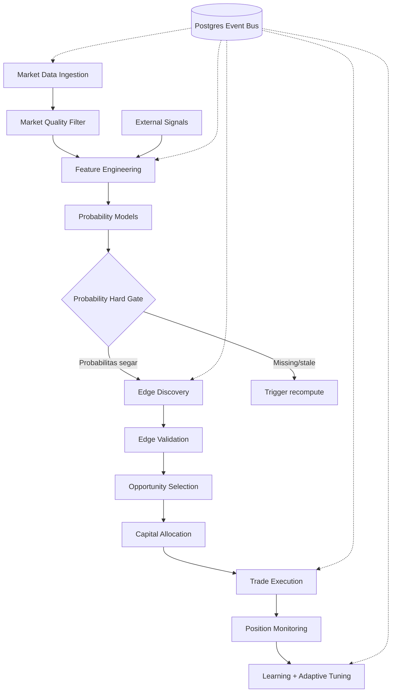

# Polymarket Trading Agent

## Apa yang Dibangun

[Polymarket Autonomous Trading Engine](https://github.com/okfriansyah-moh/edge-polymarket-agent)
adalah modular monolith yang menemukan, memvalidasi, dan mengeksekusi trade prediction
market. Fase 0–15 mengimplementasikan pipeline penuh dari ingest data pasar hingga
eksekusi trade, monitoring posisi, analitik pembelajaran, dan tuning parameter adaptif.
Semua modul berkomunikasi melalui **event bus Postgres** dengan klaim worker deterministik
via `FOR UPDATE SKIP LOCKED`.

## Masalah

Prediction market punya likuiditas terfragmentasi, quote basi, dan propagasi informasi
lambat — tetapi mengubah edge struktural menjadi profit membutuhkan lebih dari deteksi
sinyal. Sistem trading harus menegakkan **estimasi probabilitas sebelum eksekusi**,
mengalokasikan modal dengan aman di bawah batas risiko keras, dan pulih dari kegagalan
worker tanpa order duplikat atau event hilang.

## Mengapa Masalah Ini Sulit

1. **Urutan event** — data pasar, sinyal, dan event eksekusi harus mengalir melalui
   pipeline konsisten tanpa race condition.
2. **Ketergantungan probabilitas** — trading tanpa estimasi fair-value adalah spekulasi,
   bukan eksploitasi edge.
3. **Keamanan modal** — batas drawdown, exposure, dan kerugian harian harus ditegakkan
   secara atomik sebelum submit order.
4. **Siklus hidup strategi** — strategi underperform harus auto-disable tanpa intervensi
   manual.
5. **Isolasi AI** — rekomendasi LLM advisory tidak boleh memblokir atau mengubah eksekusi.

## Model Mental untuk Pemula

Bayangkan lini perakitan pabrik di mana setiap stasiun membaca dari sabuk konveyor
bersama (event Postgres). Worker mengklaim satu paket pada satu waktu, memprosesnya,
dan menaruh hasil kembali ke sabuk. Sebelum stasiun akhir (eksekusi), **inspektur
kualitas** memeriksa estimasi probabilitas ada dan segar — **tanpa probabilitas,
tanpa trade**. **Petugas risiko** terpisah membatasi ukuran posisi dan bisa menarik
emergency stop.

## Persyaratan dan Kendala

| Persyaratan | Implementasi |
|-------------|--------------|
| Pemrosesan deterministik | `WorkerLoop`: claim → process → complete/fail |
| Durabilitas event | Event bus berbasis Postgres dengan retry dan dead-letter |
| Gate probabilitas | Hard gate Fase 12.5: cek staleness sebelum eksekusi |
| Batas risiko | 7 batas keras ditegakkan oleh engine alokasi modal |
| Isolasi strategi | Permukaan plugin via implementasi `BaseStrategy` |
| Isolasi advisory AI | Advisor read-only; kegagalan tidak memengaruhi jalur eksekusi |
| Default DRY_RUN | Observasi pipeline sebelum trading live |

## Ikhtisar Arsitektur



Semua worker berjalan dalam satu proses Python (modular monolith) dan berkomunikasi
eksklusif melalui event bus — tanpa panggilan lintas modul langsung.

## Alur Eksekusi

1. **Ingest data pasar** — klien Polymarket menormalisasi orderbook; scanner menyimpan
   record pasar dan snapshot harga.
2. **Filter kualitas pasar** — cek likuiditas, spread, aktivitas, dan kedalaman; penolakan
   memancarkan `market_filtered_event`.
3. **Sinyal eksternal** — ingestor cuaca, kripto, RSS, dan kalender menghasilkan
   `external_signal_event` dengan telemetri kesehatan sumber.
4. **Feature engineering** — `feature_computed_event` versioned dengan spread, momentum,
   volatilitas, dan field sinyal opsional.
5. **Model probabilitas** — model Bayesian, Monte Carlo, dan domain-spesifik memancarkan
   `probability_computed_event`.
6. **Hard gate probabilitas** — lookup probabilitas tersimpan; ambang staleness
   (5 menit arbitrage/informational, 15 menit speculative); trigger recompute jika basi.
7. **Edge discovery** — detektor spread, imbalance likuiditas, information-lag, dan
   microstructure dengan deduplikasi.
8. **Edge validation** — gating EV, estimasi fee/slippage, latency decay, ranking.
9. **Opportunity selection** — ranking komposit (EV 35%, edge score 25%, confidence
   20%, kualitas pasar 10%, urgency 10%); filter top-K.
10. **Alokasi modal** — sizing Kelly, anggaran kategori 40/40/20, adaptive risk engine
    dengan clamp drawdown.
11. **Eksekusi trade** — adapter Polymarket CLOB dengan verifikasi approval sebelum
    build/sign/submit.
12. **Monitoring posisi + learning** — tracking P&L, metrik strategi, deteksi edge decay,
    adaptive tuning (cap ±20% per siklus).

## Komponen Penting

| Komponen | Tanggung jawab |
| -------- | -------------- |
| `core/event_bus.py` | API publish, claim, complete/fail event Postgres |
| `core/worker_runtime.py` | Siklus hidup loop worker deterministik |
| `modules/probability_engine/` | Feature builder + hard gate probabilitas |
| `modules/edge_discovery/` | Detektor edge dengan validasi kontrak event |
| `modules/capital/allocator.py` | Sizing Kelly, anggaran kategori, mode konsentrasi |
| `modules/capital/adaptive_risk_engine.py` | Komputasi `effective_risk` dinamis |
| `modules/execution/trade_executor.py` | Orkestrasi order via adapter CLOB |
| `modules/safety/kill_switch.py` | Circuit breaker dan trigger kerugian harian |
| `modules/analytics/ai_advisor.py` | Lapisan advisory read-only (Fase 14) |
| `strategies/base_strategy.py` | Antarmuka plugin untuk strategi konkret |

## Contoh Implementasi yang Disederhanakan

Pola klaim worker (disederhanakan):

```python
# disederhanakan — claim → process → complete deterministik
event = event_bus.claim_next("edge_validation")  # memakai FOR UPDATE SKIP LOCKED
if event:
    result = validator.process(event.payload)
    event_bus.complete(event.id, result)
```

Hard gate probabilitas (disederhanakan):

```python
# disederhanakan — TANPA PROBABILITAS → TANPA TRADE
prob = repo.get_probability(market_id)
if prob is None or prob.age_seconds > STALENESS_THRESHOLD:
    trigger_recomputation(market_id)
    raise ProbabilityGateBlocked(market_id)
```

Sizing risiko adaptif (disederhanakan):

```python
# disederhanakan — effective risk terbatas
effective_risk = (
    base_risk
    * strategy_weight
    * performance_multiplier
    * market_condition_multiplier
    * edge_confidence
)
effective_risk = min(effective_risk, HARD_CEILING_0_20)
```

## Keandalan dan Idempotensi

- **Penyimpanan state:** Event bus PostgreSQL dengan migrasi skema versioned.
- **Klaim worker:** `FOR UPDATE SKIP LOCKED` mencegah double-processing.
- **Retry/dead-letter:** Event gagal di-retry dengan backoff; kegagalan persisten
  diarahkan ke antrian dead-letter.
- **Auto-disable strategi:** `strategy_killer` menonaktifkan strategi pada ambang
  win-rate/ROI/drawdown yang dikonfigurasi dengan cooldown dan re-enable.
- **Kill switch:** Trigger kerugian harian dan drawdown menghentikan eksekusi segera.

## Mode Kegagalan

| Kegagalan | Perilaku |
| --------- | -------- |
| Probabilitas hilang | Trade diblokir; recompute dipicu |
| Probabilitas basi | Diblokir per ambang staleness per tipe strategi |
| Batas risiko terlampaui | Alokasi ditolak; entri audit log |
| Approval CLOB hilang | Eksekusi diblokir; `approval_missing` dicatat |
| Strategi underperform | Auto-disable via strategy killer |
| Kegagalan AI advisor | Terisolasi; jalur eksekusi tidak terpengaruh |
| Crash worker | Event tidak diklaim tetap ada; worker berikutnya mengklaim |

## Trade-off dan Alternatif yang Ditolak

| Pilihan | Alasan | Alternatif yang ditolak |
| ------- | ------ | ----------------------- |
| Modular monolith | Postgres bersama; tanpa overhead jaringan | Microservices per fase |
| Event bus Postgres | Klaim durable, queryable, transaksional | Antrian Redis/Kafka |
| Hard gate probabilitas | Menegakkan disiplin trading berbasis edge | Trade pada sinyal tanpa fair value |
| Kelly + plafon keras | Sizing matematis dengan batas keamanan | Ukuran posisi tetap |
| Isolasi AI advisor | Mencegah latency/kegagalan LLM memblokir trade | LLM di jalur eksekusi |
| Default DRY_RUN | Observasi aman sebelum risiko modal | Trading live pada deploy pertama |

## Pengujian

Repositori menyertakan suite pytest mirror di `tests/modules/` dan `tests/workers/`
untuk setiap modul yang di-merge. `make quality` menjalankan lint, cek batas import,
dan suite tes penuh. Validasi ekonomi via `make validation-run`.

## Operasi dan Observabilitas

- **Deployment:** Docker Compose di VPS (container poly-agent + postgres)
- **Koleksi log:** `scripts/collect_logs.sh` menghasilkan PRS (Production Readiness Score)
- **Kontrol:** Kill switch Telegram dan perintah circuit-breaker
- **Kesehatan:** `utils/health_check.py` dan logging JSON terstruktur
- **Mode default:** `DRY_RUN=true` — observasi sebelum mengaktifkan eksekusi live

## Pelajaran yang Dipetik

1. **TANPA PROBABILITAS → TANPA TRADE** — menegakkan estimasi fair-value sebelum
   eksekusi memisahkan eksploitasi edge dari spekulasi.
2. **Event bus sebagai lapisan integrasi** — batas modul tetap bersih ketika semua
   komunikasi mengalir melalui event yang persisten.
3. **Batas risiko keras adalah kontrak arsitektur** — clamp drawdown dan cap exposure
   harus ditegakkan di kode, bukan saran konfigurasi.
4. **Isolasi AI advisory** — rekomendasi LLM termasuk analitik, bukan jalur kritis
   eksekusi.

## Terkait

- [Ringkasan Proyek Polymarket Agent](/docs/projects/polymarket-agent)
- [Database-Backed State Machines](/docs/concepts/database-state-machines)
- [AI Orchestration Patterns](/docs/concepts/ai-orchestration-patterns)
- [LLM Guardrails](/docs/concepts/llm-guardrails)

## Sumber

- Repositori: [okfriansyah-moh/edge-polymarket-agent](https://github.com/okfriansyah-moh/edge-polymarket-agent)
- Dok arsitektur: `docs/ARCHITECTURE.md`, `docs/TRADING_EDGE_STRATEGY.md` di repo sumber
