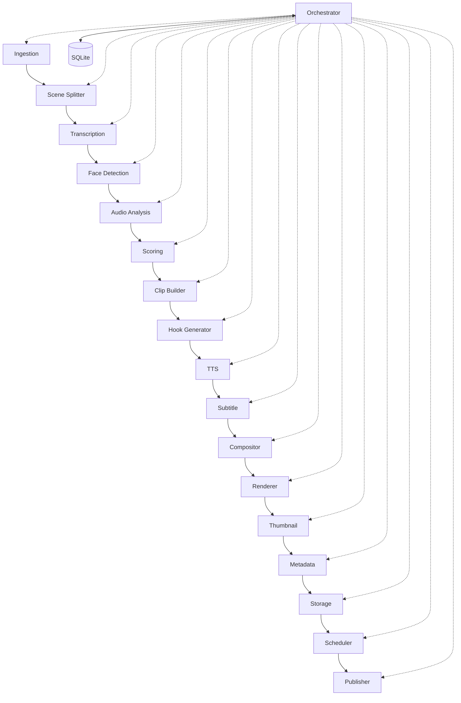

# Membangun Pipeline Pemrosesan Video Panjang yang Dapat Dilanjutkan

## Apa yang Dibangun

[Shorts Factory](https://github.com/okfriansyah-moh/shorts-generator) adalah sistem produksi konten lokal yang mengonsumsi video 5–120 menit dan menghasilkan 10–15 klip pendek vertikal dengan narasi, subtitle, thumbnail, metadata, dan penjadwalan publikasi multi-platform. Intinya adalah **pipeline berurutan 16 tahap** yang diorkestrasi oleh satu proses Python, dengan **SQLite sebagai otoritas** untuk semua state pipeline.

## Masalah

Pemrosesan video panjang mahal: transkripsi, deteksi wajah, kompositing, dan rendering bisa memakan 20–30 menit untuk input satu jam di perangkat konsumen. Jika proses crash di tahap 12, memulai ulang dari tahap 1 membuang komputasi dan menduplikasi pekerjaan. Orkestrator cloud menambah biaya; sistem ini menargetkan **biaya cloud nol** dengan eksekusi lokal saja.

## Mengapa Masalah Ini Sulit

1. **Ketergantungan antar tahap** — tahap berikutnya membutuhkan output dari tahap sebelumnya (transkrip sebelum scoring, klip sebelum rendering).
2. **Kegagalan parsial** — crash di tengah pipeline tidak boleh merusak pekerjaan yang sudah selesai.
3. **Rerun idempoten** — operator dapat menjalankan ulang pipeline dengan aman setelah perubahan konfigurasi.
4. **Fan-out multi-akun** — satu database global melayani banyak channel konten dengan override konfigurasi per akun.
5. **Penjadwalan upload** — generasi (berat CPU) dan publikasi (panggilan API) berjalan pada jadwal berbeda.

## Model Mental untuk Pemula

Bayangkan pipeline sebagai lini perakitan dengan 16 stasiun. Setiap stasiun menerima **paket beku** (dataclass DTO) dari stasiun sebelumnya dan menyerahkan paket baru ke stasiun berikutnya. Seorang **mandor** (orchestrator) adalah satu-satunya pekerja yang boleh membuka **buku besar** (SQLite). Jika pabrik kehilangan listrik, mandor membaca buku besar, menemukan stasiun terakhir yang selesai, dan melanjutkan dari stasiun berikutnya.

## Persyaratan dan Kendala

| Persyaratan                | Cara dipenuhi                                                                |
| -------------------------- | ---------------------------------------------------------------------------- |
| Output deterministik       | Tanpa randomness; scoring berbasis aturan; input + config sama = output sama |
| Rerun idempoten            | `video_id` content-addressable dari SHA256; `ON CONFLICT DO NOTHING`         |
| Isolasi modul              | Modul berkomunikasi hanya lewat DTO beku di `contracts/`                     |
| Otoritas orchestrator      | Hanya `core/orchestrator.py` yang memanggil modul dan menulis ke DB          |
| Biaya cloud nol            | FFmpeg lokal, faster-whisper, Edge TTS, SQLite                               |
| Isolasi kegagalan platform | Kegagalan upload satu platform tidak memblokir yang lain                     |

## Gambaran Arsitektur



Orchestrator mengeksekusi tahap secara ketat berurutan. Setiap modul stateless antar panggilan; persistensi terjadi melalui adapter database di `database/adapter.py`.

## Alur Eksekusi

1. **Ingestion** memvalidasi file video dan menghitung `video_id` content-addressable.
2. **Scene Splitter** mendeteksi segmen 3–20 detik via PySceneDetect.
3. **Transcription** menghasilkan timestamp per kata dengan faster-whisper.
4. **Face Detection** mengambil sampel frame pada 2fps dengan MediaPipe (opsional).
5. **Audio Analysis** mengekstrak energi RMS per scene via FFmpeg.
6. **Scoring** memberi peringkat scene dengan bobot berbasis aturan (keyword, audio, wajah, gerakan).
7. **Clip Builder** menggabungkan scene teratas menjadi klip 30–60 detik.
8. **Hook Generator** membuat skrip narasi berbasis template.
9. **TTS** mensintesis suara dengan Edge TTS (di-cache berdasarkan hash teks).
10. **Subtitle** menghasilkan subtitle ASS karaoke dari timing kata.
11. **Compositor** membangun layout 9:16 (gameplay, crop pembicara podcast, atau crop olahraga).
12. **Renderer** menggabungkan layer menjadi MP4 final via FFmpeg.
13. **Thumbnail** memilih frame dan menempatkan overlay teks dengan Pillow.
14. **Metadata** menetapkan judul, deskripsi, dan tag.
15. **Storage** menyimpan record klip dan path filesystem.
16. **Scheduler** menetapkan tanggal publikasi; **Publisher** mendistribusikan ke platform yang diaktifkan.

## Komponen Penting

| Komponen                              | Tanggung jawab                                           |
| ------------------------------------- | -------------------------------------------------------- |
| `core/orchestrator.py`                | Urutan tahap, checkpointing, penanganan error            |
| `contracts/*.py`                      | DTO dataclass beku antar tahap                           |
| `database/adapter.py`                 | Satu-satunya lapisan akses database                      |
| `core/account_loader.py`              | Deep-merge override konfigurasi per akun                 |
| `modules/publisher/multi_platform.py` | Thread upload per platform secara konkuren               |
| `scripts/upload_scheduler.py`         | Runner publikasi berbasis cron                           |
| `scripts/generation_scheduler.py`     | Memilih video mentah berikutnya dan menjalankan pipeline |

## Contoh Implementasi yang Disederhanakan

Video ID content-addressable (disederhanakan):

```python
# simplified — pattern from shorts-generator ingestion
video_id = sha256(first_10_mb + file_size)[:16]
```

Konsep resume checkpoint (disederhanakan):

```python
# simplified — orchestrator reads last completed stage from SQLite
last_stage = db.get_last_completed_stage(video_id)
for stage in STAGES[last_stage_index + 1:]:
    result = stage.run(previous_dto)
    db.record_stage_complete(video_id, stage.name)
```

## Keandalan dan Idempotensi

- **Penyimpanan state:** `shorts_factory.db` (SQLite) adalah single source of truth.
- **Tahap sinkron:** Semua 16 tahap pipeline berjalan berurutan dalam satu proses.
- **Upload asinkron:** Publisher memunculkan satu thread per platform; scheduler berjalan via cron terpisah dari generasi.
- **Idempotensi:** ID content-addressable dan `ON CONFLICT DO NOTHING` membuat rerun aman. Output tahap yang di-cache di DB mencegah komputasi redundan saat resume.

## Mode Kegagalan

| Kegagalan                  | Perilaku                                                                    |
| -------------------------- | --------------------------------------------------------------------------- |
| Crash di tengah pipeline   | Resume dari tahap terakhir yang tercatat di SQLite                          |
| Satu platform upload gagal | Platform lain melanjutkan; klip ditandai `published` jika ada yang berhasil |
| Semua platform gagal       | Status klip → `failed`; error dicatat                                       |
| Kredensial hilang          | Platform dilewati sepenuhnya (tanpa percobaan auth)                         |
| GPU tidak tersedia         | Fallback CPU otomatis untuk transkripsi dan encoding                        |

## Trade-off dan Alternatif yang Ditolak

| Pilihan                            | Alasan                                  | Alternatif yang ditolak                                    |
| ---------------------------------- | --------------------------------------- | ---------------------------------------------------------- |
| Modular monolith                   | Overhead orkestrasi nol, SQLite bersama | Microservices — menambah biaya jaringan dan kompleksitas   |
| SQLite                             | Satu file, lokal, tanpa server          | PostgreSQL — tidak perlu untuk pipeline satu mesin         |
| Scoring berbasis aturan            | Deterministik, dapat direproduksi       | Scoring LLM — non-deterministik, menambah biaya API        |
| Scheduler generasi/upload terpisah | Pekerjaan CPU vs panggilan API ringan   | Satu cron — tidak dapat mengoptimalkan beban kerja berbeda |

## Pengujian

Repositori menyertakan `tests/unit/` dan `tests/integration/` yang mencakup kontrak modul, layout compositor, dan perilaku publisher. Kualitas ditegakkan melalui validasi DTO deterministik dan integration test terhadap fixture media sampel.

## Operasi dan Observabilitas

- **Generasi:** `python scripts/generation_scheduler.py --account <name>`
- **Upload:** `python scripts/upload_scheduler.py --account <name>` (3 gelombang cron/hari)
- **Log:** `pipeline.log` per video di bawah `output/<account>/<video_folder>/`
- **Rebuild DB:** `python scripts/rebuild_db.py` merekonstruksi state dari filesystem

## Pelajaran yang Dipetik

1. **Checkpoint di batas tahap** — titik resume kasar mengalahkan recovery sub-langkah halus untuk pipeline video.
2. **Kontrak DTO beku** — isolasi modul memungkinkan pengembangan dan pengujian paralel.
3. **Pisahkan generasi berat dari publikasi ringan** — jadwal berbeda, domain kegagalan berbeda.
4. **Fan-out dengan isolasi kegagalan** — publikasi multi-platform membutuhkan penangkapan error per thread, bukan semantik fail-fast.

## Sumber

- Repository: [okfriansyah-moh/shorts-generator](https://github.com/okfriansyah-moh/shorts-generator)
- Pull requests: [#8 scheduler mechanism](https://github.com/okfriansyah-moh/shorts-generator/pull/8), [#10 multi-platform publish](https://github.com/okfriansyah-moh/shorts-generator/pull/10), [#11 sports video type](https://github.com/okfriansyah-moh/shorts-generator/pull/11)
- Dokumentasi arsitektur: `docs/architecture.md`, `docs/orchestrator_spec.md` di repo sumber
