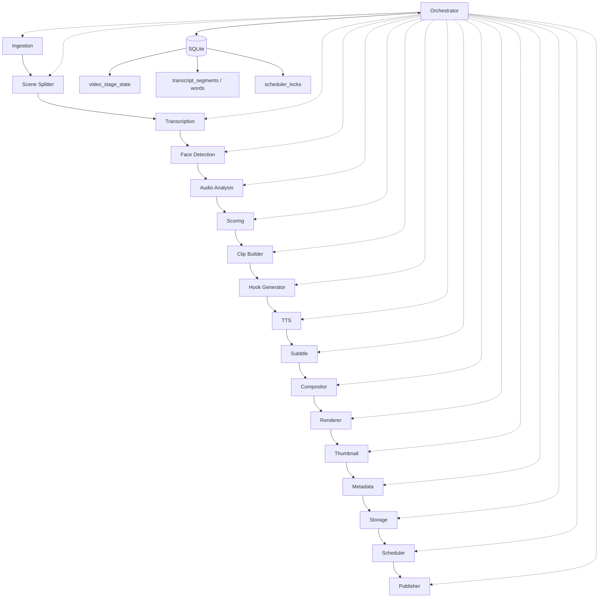

# Membangun Pipeline Pemrosesan Video Panjang yang Dapat Dilanjutkan

## Apa yang Dibangun

[Shorts Factory](https://github.com/okfriansyah-moh/shorts-generator) adalah sistem produksi konten lokal yang mengonsumsi video panjang (batas durasi dihapus di
[PR #12](https://github.com/okfriansyah-moh/shorts-generator/pull/12)) dan menghasilkan
10–15 klip pendek vertikal dengan narasi, subtitle, thumbnail, metadata, dan
penjadwalan publikasi multi-platform. Intinya adalah **pipeline berurutan 16 tahap**
yang diorkestrasi oleh satu proses Python, dengan **SQLite sebagai otoritas** untuk
semua state pipeline — termasuk **baris cache per tahap**, **persistensi transkrip
per chunk**, dan **kunci scheduler** untuk loop generasi otomatis.

## Masalah

Pemrosesan video panjang mahal: transkripsi, deteksi wajah, kompositing, dan rendering bisa memakan 20–30 menit untuk input satu jam di perangkat konsumen. Jika proses crash di tahap 12, memulai ulang dari tahap 1 membuang komputasi dan menduplikasi pekerjaan. Orkestrator cloud menambah biaya; sistem ini menargetkan **biaya cloud nol** dengan eksekusi lokal saja.

## Mengapa Masalah Ini Sulit

1. **Ketergantungan antar tahap** — tahap berikutnya membutuhkan output dari tahap sebelumnya (transkrip sebelum scoring, klip sebelum rendering).
2. **Kegagalan parsial** — crash di tengah pipeline tidak boleh merusak pekerjaan yang sudah selesai.
3. **Rerun idempoten** — operator dapat menjalankan ulang pipeline dengan aman setelah perubahan konfigurasi.
4. **Fan-out multi-akun** — satu database global melayani banyak channel konten dengan override konfigurasi per akun.
5. **Penjadwalan upload** — generasi (berat CPU) dan publikasi (panggilan API) berjalan pada jadwal berbeda.
6. **Input sangat panjang** — video berjam-jam membutuhkan transkripsi ter-chunk dengan progress yang dapat dilanjutkan, bukan satu pass in-memory.
7. **Scheduler konkuren** — cron job di mesin yang sama tidak boleh menjalankan dua pipeline generasi sekaligus.

## Model Mental untuk Pemula

Bayangkan pipeline sebagai lini perakitan dengan 16 stasiun. Setiap stasiun menerima **paket beku** (dataclass DTO) dari stasiun sebelumnya dan menyerahkan paket baru ke stasiun berikutnya. Seorang **mandor** (orchestrator) adalah satu-satunya pekerja yang boleh membuka **buku besar** (SQLite). Jika pabrik kehilangan listrik, mandor membaca buku besar, menemukan stasiun terakhir yang selesai, dan melanjutkan dari stasiun berikutnya.

## Persyaratan dan Kendala

| Persyaratan                | Cara dipenuhi                                                                |
| -------------------------- | ---------------------------------------------------------------------------- |
| Output deterministik       | Tanpa randomness; scoring berbasis aturan; input + config sama = output sama |
| Rerun idempoten            | `video_id` content-addressable dari SHA256; `ON CONFLICT DO NOTHING`         |
| Isolasi modul              | Modul berkomunikasi hanya lewat DTO beku di `contracts/`                     |
| Otoritas orchestrator      | Hanya `core/orchestrator.py` yang memanggil modul dan menulis ke DB          |
| Biaya cloud nol            | FFmpeg lokal, faster-whisper, Edge TTS, SQLite                               |
| Isolasi kegagalan platform | Kegagalan upload satu platform tidak memblokir yang lain                     |
| Dukungan video panjang     | `max_duration_seconds: 0` menonaktifkan batas; renderer hingga 250 MB       |
| Resume sub-tahap           | `video_stage_state` meng-cache tahap formal dan sub-tahap analisis           |
| Eksklusi mutual scheduler  | `scheduler_locks` dengan TTL + heartbeat selama generasi                    |

## Gambaran Arsitektur


```mermaid
flowchart TD
  IN[Ingestion] --> SS[Scene Splitter]
  SS --> TR[Transcription]
  TR --> FD[Face Detection]
  FD --> AA[Audio Analysis]
  AA --> SC[Scoring]
  SC --> CB[Clip Builder]
  CB --> HG[Hook Generator]
  HG --> TTS[TTS]
  TTS --> SUB[Subtitle]
  SUB --> CMP[Compositor]
  CMP --> REN[Renderer]
  REN --> TH[Thumbnail]
  TH --> MD[Metadata]
  MD --> ST[Storage]
  ST --> SCH[Scheduler]
  SCH --> PUB[Publisher]

  ORCH[Orchestrator] -.-> IN & SS & TR & FD & AA & SC & CB & HG & TTS & SUB & CMP & REN & TH & MD & ST & SCH & PUB
  ORCH <--> DB[(SQLite)]
  DB --> STC[video_stage_state]
  DB --> TSEG[transcript_segments / words]
  DB --> SLK[scheduler_locks]
```

Orchestrator mengeksekusi tahap secara ketat berurutan. Setiap modul stateless antar panggilan; persistensi terjadi melalui adapter database di `database/adapter.py`.
Sejak PR #12, adapter juga memiliki **CRUD stage-cache** (DTO `StageState` di
`contracts/stage_state.py`), **tabel chunk transkrip**, dan acquire/heartbeat/release
**kunci scheduler** — sehingga resume dan otomasi cron berbagi satu file SQLite.

## Alur Eksekusi

1. **Ingestion** memvalidasi file video dan menghitung `video_id` content-addressable.
2. **Scene Splitter** mendeteksi segmen 3–20 detik via PySceneDetect.
3. **Transcription** membagi audio menjadi chunk yang dapat dikonfigurasi (default 300 dtk dengan overlap 2 dtk), menyimpan setiap chunk ke `transcript_segments` / `transcript_words`, dan melanjutkan dari indeks chunk terakhir saat retry.
4. **Face Detection** mengambil sampel frame pada 2fps dengan MediaPipe (opsional).
5. **Audio Analysis** mengekstrak energi RMS per scene via FFmpeg.
6. **Scoring** memberi peringkat scene dengan bobot berbasis aturan (keyword, audio, wajah, gerakan).
7. **Clip Builder** menggabungkan scene teratas menjadi klip 30–60 detik.
8. **Hook Generator** membuat skrip narasi berbasis template.
9. **TTS** mensintesis suara dengan Edge TTS (di-cache berdasarkan hash teks).
10. **Subtitle** menghasilkan subtitle ASS karaoke dari timing kata.
11. **Compositor** membangun layout 9:16 (gameplay, crop pembicara podcast, atau crop olahraga).
12. **Renderer** menggabungkan layer menjadi MP4 final via FFmpeg.
13. **Thumbnail** memilih frame dan menempatkan overlay teks dengan Pillow.
14. **Metadata** menetapkan judul, deskripsi, dan tag.
15. **Storage** menyimpan record klip dan path filesystem.
16. **Scheduler** menetapkan tanggal publikasi; **Publisher** mendistribusikan ke platform yang diaktifkan.

**Loop generasi otomatis (PR #12):** saat `upload_scheduler.py` mengosongkan antrean publikasi, ia memunculkan `generation_scheduler.py`, yang memperoleh kunci berbasis DB `generation:<account>` (TTL 15 menit, heartbeat saat berjalan), memilih file mentah berikutnya di `raw/`, menjalankan pipeline penuh, mengekspor `pending_ai_metadata.json` untuk enrichment AI terjadwal, dan menandai sumber sebagai sudah diproses.

## Komponen Penting

| Komponen                              | Tanggung jawab                                           |
| ------------------------------------- | -------------------------------------------------------- |
| `core/orchestrator.py`                | Urutan tahap, checkpointing, penanganan error            |
| `contracts/*.py`                      | DTO dataclass beku antar tahap                           |
| `database/adapter.py`                 | Satu-satunya lapisan akses database                      |
| `core/account_loader.py`              | Deep-merge override konfigurasi per akun                 |
| `modules/publisher/multi_platform.py` | Thread upload per platform secara konkuren               |
| `contracts/stage_state.py`            | DTO `StageState` beku untuk baris cache                  |
| `video_stage_state` table             | Cache per tahap dengan config hash + progress            |
| `scheduler_locks` table               | Eksklusi mutual untuk cron job generasi                  |
| `scripts/generation_scheduler.py`     | Pemilih video mentah dengan kunci + menjalankan pipeline |
| `scripts/upload_scheduler.py`         | Runner publikasi cron; memicu generasi saat antrean kosong |

## Contoh Implementasi yang Disederhanakan

Video ID content-addressable (disederhanakan):

```python
# simplified — pattern from shorts-generator ingestion
video_id = sha256(first_10_mb + file_size)[:16]
```

Invalidasi stage-cache (disederhanakan):

```python
# simplified — config_hash mismatch invalidates this stage and all downstream cache
if state.config_hash != current_config_hash(stage_name):
    adapter.invalidate_stage_states(video_id, stages_from_here_onward)
```

Resume transkripsi ter-chunk (disederhanakan):

```python
# simplified — skip chunks already persisted; update units_done on video_stage_state
cached = adapter.get_transcript_chunk_indexes(video_id)
for chunk_index, audio_slice in enumerate(chunks):
    if chunk_index in cached:
        continue
    adapter.save_transcript_chunk(video_id, chunk_index, transcribe_chunk(audio_slice))
```

## Keandalan dan Idempotensi

- **Penyimpanan state:** `shorts_factory.db` (SQLite) adalah single source of truth.
- **Tahap sinkron:** Semua 16 tahap pipeline berjalan berurutan dalam satu proses.
- **Upload asinkron:** Publisher memunculkan satu thread per platform; scheduler berjalan via cron terpisah dari generasi.
- **Idempotensi:** ID content-addressable dan `ON CONFLICT DO NOTHING` membuat rerun aman. Output tahap yang di-cache di `video_stage_state` (dikunci oleh `stage_name` + `config_hash`) mencegah komputasi redundan saat resume; perubahan config menginvalidasi baris cache downstream sesuai urutan dependensi.
- **Kunci generasi:** Hanya satu run `generation_scheduler` yang memegang `scheduler_locks.generation:<account>` pada satu waktu; TTL kedaluwarsa plus hilangnya heartbeat menghentikan run daripada risiko pipeline tumpang tindih.
- **Penjaga duplikat sumber:** Generation scheduler mem-fingerprint 10 MB pertama + ukuran file dan melewati file mentah yang `video_id`-nya sudah ada di database, meskipun nama file berbeda.

## Mode Kegagalan

| Kegagalan                  | Perilaku                                                                    |
| -------------------------- | --------------------------------------------------------------------------- |
| Crash di tengah pipeline   | Resume dari tahap terakhir yang tercatat di SQLite                          |
| Satu platform upload gagal | Platform lain melanjutkan; klip ditandai `published` jika ada yang berhasil |
| Semua platform gagal       | Status klip → `failed`; error dicatat                                       |
| Kredensial hilang          | Platform dilewati sepenuhnya (tanpa percobaan auth)                         |
| GPU tidak tersedia         | Fallback CPU otomatis untuk transkripsi dan encoding                        |
| Kunci generasi hilang      | Scheduler berhenti; kunci dilepas saat exit; retry pada cron berikutnya    |
| File mentah duplikat (rename) | Hash konten cocok → tandai processed tanpa menjalankan ulang pipeline |
| Klip render terlalu besar  | Batas `max_file_size_mb: 250` (≤ 0 menonaktifkan) menolak MP4 oversize   |

## Trade-off dan Alternatif yang Ditolak

| Pilihan                            | Alasan                                  | Alternatif yang ditolak                                    |
| ---------------------------------- | --------------------------------------- | ---------------------------------------------------------- |
| Modular monolith                   | Overhead orkestrasi nol, SQLite bersama | Microservices — menambah biaya jaringan dan kompleksitas   |
| SQLite                             | Satu file, lokal, tanpa server          | PostgreSQL — tidak perlu untuk pipeline satu mesin         |
| Scoring berbasis aturan            | Deterministik, dapat direproduksi       | Scoring LLM — non-deterministik, menambah biaya API        |
| Scheduler generasi/upload terpisah | Pekerjaan CPU vs panggilan API ringan   | Satu cron — tidak dapat mengoptimalkan beban kerja berbeda |
| Cache tahap DB vs filesystem saja | Resume granular + invalidasi config     | Checkpoint filesystem saja — progress sulit di-query       |
| Transkripsi ter-chunk             | Memori terbatas untuk sumber multi-jam  | Whisper satu pass — risiko OOM pada audio sangat panjang   |
| Antrean upload memicu generasi    | Pipeline tetap terisi tanpa drop manual | Cron generasi tetap — bisa idle saat antrean kosong        |

## Pengujian

Repositori menyertakan `tests/unit/` dan `tests/integration/` yang mencakup kontrak modul, layout compositor, perilaku publisher, API stage-cache adapter database, batas ukuran renderer, dan kunci upload/generation scheduler. PR #12 menambahkan cakupan `test_adapter.py`, `test_upload_scheduler.py`, dan `test_renderer.py` untuk jalur persistensi dan kunci baru.

## Operasi dan Observabilitas

- **Generasi:** `python scripts/generation_scheduler.py --account <name>` (atau otomatis dipicu saat antrean upload kosong)
- **Upload:** `python scripts/upload_scheduler.py --account <name>` (3 gelombang cron/hari)
- **Skill terjadwal:** `docs/claude_scheduled_tasks/shorts-generator-8am.SKILL.md` (enrichment metadata AI) dan `shorts-generator-8pm.SKILL.md` (cron generasi) mendokumentasikan prosedur operator
- **Log:** `pipeline.log` per video di bawah `output/<account>/<video_folder>/`; generation scheduler juga mencatat ke `output/generation_scheduler.log`
- **Rebuild DB:** `python scripts/rebuild_db.py` merekonstruksi state dari filesystem

## Pelajaran yang Dipetik

1. **Checkpoint di batas tahap** — titik resume kasar mengalahkan recovery sub-langkah halus untuk pipeline video.
2. **Kontrak DTO beku** — isolasi modul memungkinkan pengembangan dan pengujian paralel.
3. **Pisahkan generasi berat dari publikasi ringan** — jadwal berbeda, domain kegagalan berbeda.
4. **Fan-out dengan isolasi kegagalan** — publikasi multi-platform membutuhkan penangkapan error per thread, bukan semantik fail-fast.
5. **Cache di granularitas sub-tahap** — chunk transkripsi dan metrik analisis (`audio_rms_raw`, `scene_activity_raw`, `image_quality_raw`) termasuk di SQLite, bukan hanya DTO ephemeral, agar resume bertahan setelah proses mati di tengah chunk.
6. **Kunci DB mengalahkan file lock untuk cron** — baris TTL + heartbeat di `scheduler_locks` lebih mudah diinspeksi dan di-expire daripada file PID di satu mesin.

## Sumber

- Repository: [okfriansyah-moh/shorts-generator](https://github.com/okfriansyah-moh/shorts-generator)
- Pull requests: [#8 scheduler mechanism](https://github.com/okfriansyah-moh/shorts-generator/pull/8), [#10 multi-platform publish](https://github.com/okfriansyah-moh/shorts-generator/pull/10), [#11 sports video type](https://github.com/okfriansyah-moh/shorts-generator/pull/11), [#12 large video + stage cache + dynamic generation](https://github.com/okfriansyah-moh/shorts-generator/pull/12)
- Dokumentasi arsitektur: `docs/architecture.md`, `docs/orchestrator_spec.md` di repo sumber
